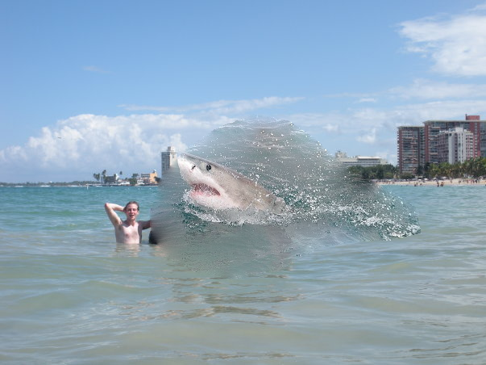
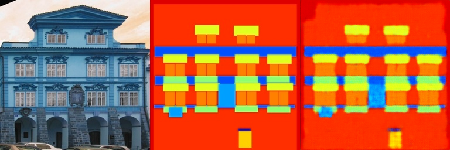
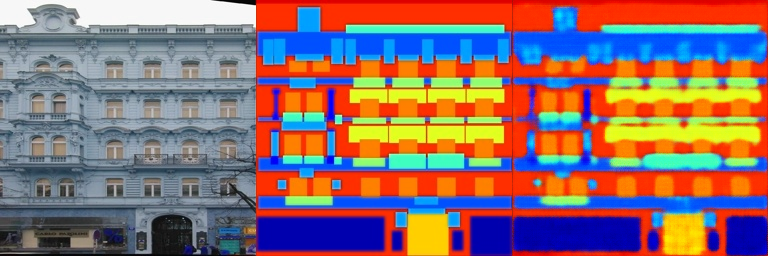
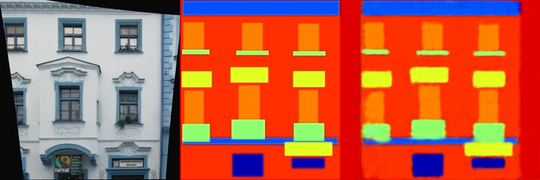

# 第二次作业提交说明

本次作业包含两部分内容：Poisson Image Editing 与 Pix2Pix 图像到图像翻译。提交目录中仅保留了与作业要求直接相关的代码、结果图和本说明文档，其余中间文件、调试脚本和效果较差的结果图均未放入。

## 一、文件夹结构

```text
Assignment02/
├─ README.md
├─ Poisson/
│  ├─ run_blending_gradio.py
│  ├─ poisson_water_result.png
│  └─ poisson_water_comparison.png
└─ Pix2Pix/
   ├─ FCN_network.py
   ├─ facades_dataset.py
   ├─ train.py
   └─ figures/
      ├─ pix2pix_result_1.png
      ├─ pix2pix_result_2.png
      ├─ pix2pix_result_4.png
      └─ pix2pix_result_5.png
```

## 二、Poisson Image Editing

### 1. 任务说明

Poisson 部分的目标是：从前景图像中选取一个多边形区域，将其平移到背景图像的指定位置，并通过梯度域优化实现自然融合，使结果尽量避免直接拷贝带来的明显边界。

### 2. 实现方法

本部分在 `run_blending_gradio.py` 中完成了作业要求的核心内容，主要包括：

1. 将用户圈定的多边形区域转换为二值 mask。
2. 将前景区域按照给定的 `dx`、`dy` 平移到背景图中对应位置。
3. 在 mask 区域内进行 Poisson 融合优化。
4. 使用梯度域约束，使融合结果在保留前景结构的同时，与背景边界自然衔接。

Poisson 融合的核心思想不是直接复制像素值，而是尽量保持前景区域内部的梯度信息，再结合背景边界条件求得新的像素值，因此结果通常会比简单粘贴更加自然。

### 3. 提交结果

最终融合图：



对比图：


从结果可以看出，目标区域中的主体已经被融合到新的背景场景中，边界过渡比直接粘贴更加自然，符合 Poisson Image Editing 的预期目标。

## 三、Pix2Pix

### 1. 任务说明

Pix2Pix 部分要求基于 facades 数据集完成图像到图像翻译任务。输入为建筑图像，目标输出为对应的语义分割结果。作业中采用了简化的 FCN 结构完成这一映射学习。

### 2. 实现内容

本部分提交了以下代码文件：

- `Pix2Pix/FCN_network.py`：实现全卷积网络结构
- `Pix2Pix/facades_dataset.py`：实现 facades 数据集读取与预处理
- `Pix2Pix/train.py`：实现训练、验证与结果保存流程

### 3. 训练方式

训练在服务器上完成，主要流程如下：

1. 读取 facades 数据集训练集与验证集。
2. 使用 FCN 网络进行端到端训练。
3. 以 `L1 Loss` 作为重建损失。
4. 使用 `Adam` 优化器更新参数。
5. 定期保存训练过程中的可视化结果图。

### 4. 提交结果说明

由于部分结果图生成效果较差，本次提交只保留了质量相对较好的样例，避免无关或低质量内容影响展示。下列结果图均来自训练后期，能够较好地反映模型已经学习到建筑场景的主要结构与区域对应关系。图中一般按照“输入图像 / 目标语义图 / 模型输出”的顺序排列。

结果 1：


结果 2：



结果 4：



结果 5：



### 5. 结果分析

从保留下来的可视化结果来看，模型已经能够学习输入建筑图像与目标语义图之间的基本映射关系，建筑主体、窗户、墙体等主要区域具有一定可辨识性。与此同时，部分边缘仍然存在模糊现象，说明当前实现虽然能够完成基本的图像翻译任务，但在细节刻画方面还有提升空间。

这也符合本次作业的实验特点：通过一个较为基础的 FCN 网络完成图像到图像映射，可以验证深度学习方法在该任务上的有效性，但生成结果的精细程度仍受网络结构与损失函数设计影响。

## 四、总结

本次作业分别完成了传统图像处理方法与深度学习方法的实践：

1. 在 Poisson Image Editing 部分，实现了多边形区域选择、mask 构建与梯度域融合。
2. 在 Pix2Pix 部分，实现了 FCN 网络、数据集读取与训练流程，并得到了可用的图像翻译结果。

本提交目录已经去除了无关文件，仅保留作业要求中最核心的代码、结果与说明文档，可直接作为最终提交内容。
