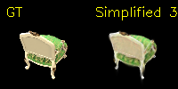
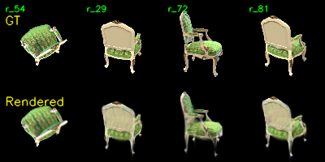
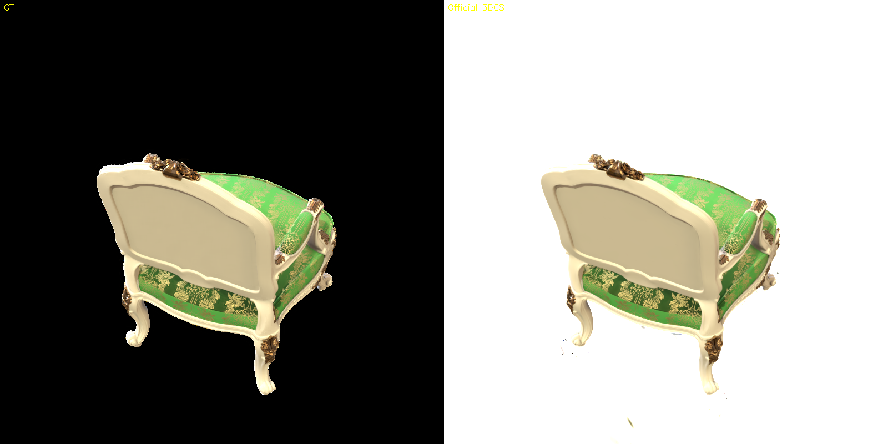

# Assignment 04 - Simplified 3D Gaussian Splatting

本次作业完成了一个简化版 3D Gaussian Splatting pipeline，并在 `chair` 多视角数据上完成了 COLMAP 重建、PyTorch 版 3DGS 训练，以及与官方 3DGS 的结果对比。仓库中保留了核心代码、运行脚本、结果图、指标文件和日志摘要，未提交官方大模型 checkpoint、COLMAP database 等体积较大的中间文件。

## 目录结构

```text
Assignment04/
├─ README.md
├─ REPORT.md
├─ gaussian_model.py
├─ gaussian_renderer.py
├─ train.py
├─ data_utils.py
├─ mvs_with_colmap.py
├─ debug_mvs_by_projecting_pts.py
├─ evaluate_simplified.py
├─ evaluate_official_renders.py
├─ render_3dgs_mv.py
├─ run_colmap_chair.sh
├─ run_simplified_train_chair.sh
├─ data/
│  ├─ chair/images/
│  └─ lego/images/
└─ results/
   ├─ colmap/
   ├─ simplified/
   ├─ official/
   └─ logs/
```

## 实现内容

本次主要补全了简化版 3DGS 的核心部分：

1. `gaussian_model.py`：由 scale 和 quaternion rotation 构造 3D covariance。
2. `gaussian_renderer.py`：实现 3D Gaussian 到图像平面的投影、2D Gaussian 权重计算和 alpha blending。
3. `train.py`：完成训练循环、debug 可视化、checkpoint 保存、训练耗时和 CUDA 显存记录。
4. `mvs_with_colmap.py`：调用 COLMAP 完成 SfM，并生成 3DGS 初始化需要的相机参数和稀疏点云。
5. `evaluate_simplified.py` 与 `evaluate_official_renders.py`：统计全图和前景区域的 L1、MSE、PSNR，并保存可视化对比图。

简化版 3DGS 没有实现官方版本中的 tile-based CUDA rasterizer 和 adaptive densification，因此 Gaussian 数量固定为 COLMAP 稀疏点数量，训练速度和细节表达能力都弱于官方实现。

## 运行方式

服务器环境：

```bash
cd /home/czr/dip_hw4_3dgs_project
source ~/miniconda3/etc/profile.d/conda.sh && conda activate pytorch_h100
```

运行 COLMAP：

```bash
export COLMAP_BIN=/home/czr/stage2_3dgs_indoor/tools/colmap
export COLMAP_USE_GPU=0
bash run_colmap_chair.sh
```

训练简化版 3DGS：

```bash
CUDA_VISIBLE_DEVICES=4 bash run_simplified_train_chair.sh
```

评估简化版结果：

```bash
CUDA_VISIBLE_DEVICES=4 python evaluate_simplified.py \
  --colmap_dir data/chair \
  --checkpoint outputs/chair_simplified_30/checkpoint_000030.pt \
  --output_dir outputs/chair_simplified_30/eval \
  --save_examples 8
```

前景区域评估：

```bash
CUDA_VISIBLE_DEVICES=4 python evaluate_simplified.py \
  --colmap_dir data/chair \
  --checkpoint outputs/chair_simplified_30/checkpoint_000030.pt \
  --output_dir outputs/chair_simplified_30/eval_foreground \
  --save_examples 8 \
  --foreground_only
```

## COLMAP 结果

本次实验使用 `chair` 数据集，共 100 张多视角 RGBA 图像。COLMAP 恢复了 13,763 个稀疏三维点，并生成 100 张投影验证图。

| 项目 | 结果 |
| --- | ---: |
| 输入图像数量 | 100 |
| COLMAP 稀疏点数量 | 13,763 |
| 投影验证图数量 | 100 |

投影验证示例：


COLMAP 文本模型保存在：

```text
results/colmap/0_text/
```

## 简化版 3DGS 结果

简化版 PyTorch 3DGS 直接使用 COLMAP 稀疏点初始化 Gaussian，因此最终 Gaussian 数量仍为 13,763。训练 30 epochs 后，全图平均 PSNR 为 20.64 dB。

| 项目 | 结果 |
| --- | ---: |
| Gaussian 数量 | 13,763 |
| 训练轮数 | 30 epochs |
| 训练耗时 | 27 min 19.61 s |
| Peak CUDA memory | 10,190.70 MB |
| 全图 mean PSNR | 20.64 dB |
| 前景 mean PSNR | 14.26 dB |

简化版渲染示例：



训练过程可视化：



多视角渲染视频：

[render_mv.mp4](./results/simplified/chair_simplified_30/render_mv.mp4)

## 官方 3DGS 对比

官方 3DGS 使用同一份 COLMAP scene 和同一组 `chair` 图像训练 30,000 iterations。官方实现包含 CUDA rasterizer、tile-based rendering 和 adaptive densification，最终 Gaussian 数量增长到 461,872，训练时间明显短于简化版。

| 方法 | Gaussian 数量 | 训练时间 | 指标口径 | mean PSNR |
| --- | ---: | ---: | --- | ---: |
| 简化版 PyTorch 3DGS | 13,763 | 27 min 19.61 s | 全图 | 20.64 dB |
| 简化版 PyTorch 3DGS | 13,763 | 27 min 19.61 s | 前景 | 14.26 dB |
| 官方 3DGS | 461,872 | 7 min 27.18 s | 前景 | 20.12 dB |

官方 3DGS 渲染示例：



需要注意的是，官方渲染输出背景为白色，而 GT 图像导出时为黑色背景。如果直接计算全图指标，大面积背景颜色差异会主导 MSE，使官方全图 PSNR 只有约 1 dB。因此这里额外计算了 foreground-only PSNR，只在 GT 非黑色前景区域统计误差，更能反映椅子本体的重建质量。

## 结果分析

从可视化结果可以看到，简化版实现能够重建椅子的主要轮廓和颜色结构，但细节仍然偏模糊，尤其是椅背边缘、金色装饰和纹理区域。主要原因是简化版没有自适应增加 Gaussian 的机制，只能使用 COLMAP 的稀疏点作为固定初始化，空间覆盖不足。

官方 3DGS 在前景区域的细节明显更好，训练时间也更短。差异主要来自三个方面：

1. 官方实现使用 CUDA tile-based rasterization，避免了简化版 PyTorch 在整张图像上直接计算所有 Gaussian 的高开销。
2. 官方实现有 adaptive densification，会在梯度大、细节复杂的区域增加 Gaussian，最终高斯数量约为简化版的 33.6 倍。
3. 官方实现包含更成熟的训练策略和参数调度，因此收敛速度和渲染质量都更好。

## 说明

完整实验报告见 [REPORT.md](./REPORT.md)。服务器完整实验目录为：

```text
/home/czr/dip_hw4_3dgs_project
```

仓库中未保留 `database.db`、官方 `point_cloud.ply` 和 PyTorch checkpoint 文件，避免提交体积过大；关键指标、图片、视频和日志摘要均已放入 `results/`。
