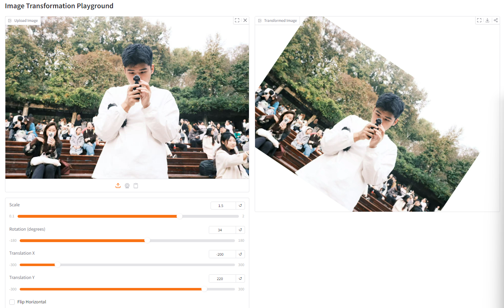
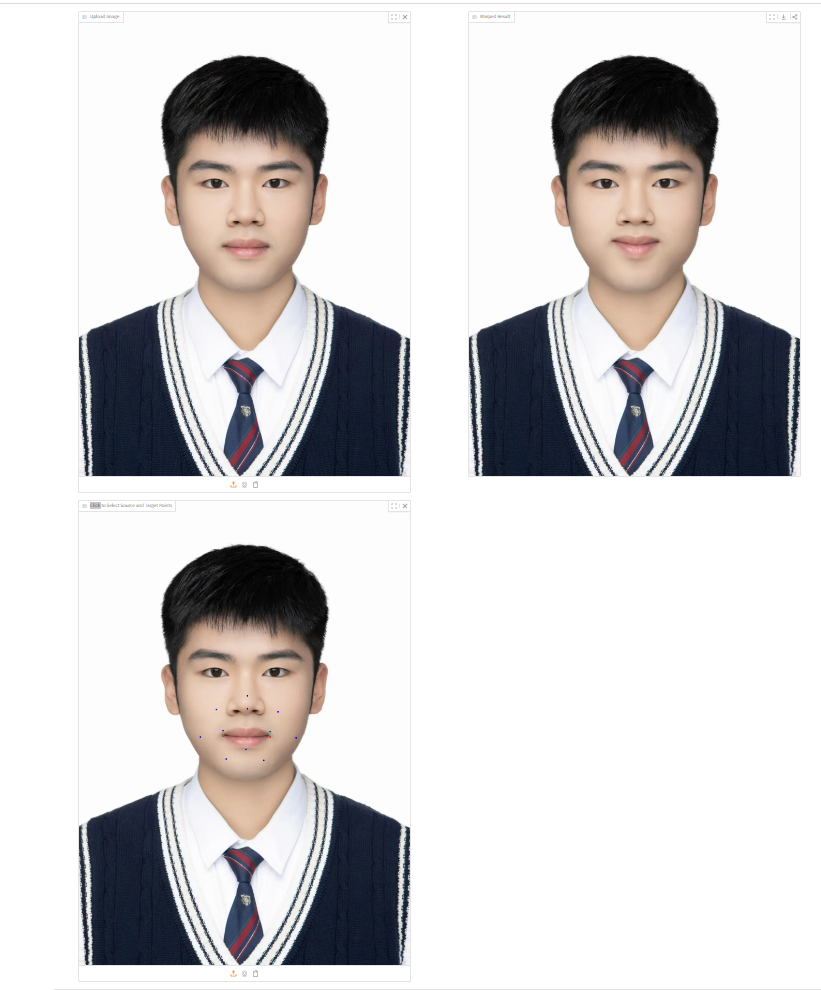

# Assignment 1 - Image Warping

### In this assignment, I will implement basic transformation and point-based deformation for images.


### 1. Basic Image Geometric Transformation (Scale/Rotation/Translation).
Implemented in `run_global_transform.py`. The script provides an interactive Gradio interface to apply scale, rotation, translation, and horizontal flip transformations to an image.

### 2. Point Based Image Deformation.
Implemented RBF-based image warping in `run_point_transform.py`. The implementation uses radial basis functions (Gaussian kernel) to compute a smooth deformation field from source to target control points. The interface allows clicking source and target points on the image and runs the deformation.

## Implementation of Image Geometric Transformation

This repository contains the implementation of Assignment 01 of DIP (Digital Image Processing). The code has been completed with interactive Gradio interfaces for both global and point-based transformations.

## Requirements

To install requirements:

```setup
python -m pip install -r requirements.txt
```


## Running

To run basic transformation, run:

```basic
python run_global_transform.py
```

To run point guided transformation, run:

```point
python run_point_transform.py
```

## Results

### Basic Transformation
The global transformation interface allows adjusting scale, rotation, translation, and flip. Below is an example result:




### Point Guided Deformation:
The point-based deformation uses RBF with Gaussian kernel. Users can click source (blue) and target (red) points, and the algorithm warps the image accordingly. Example:




## Acknowledgement

>📋 Thanks for the algorithms proposed by [Image Deformation Using Moving Least Squares](https://people.engr.tamu.edu/schaefer/research/mls.pdf).
