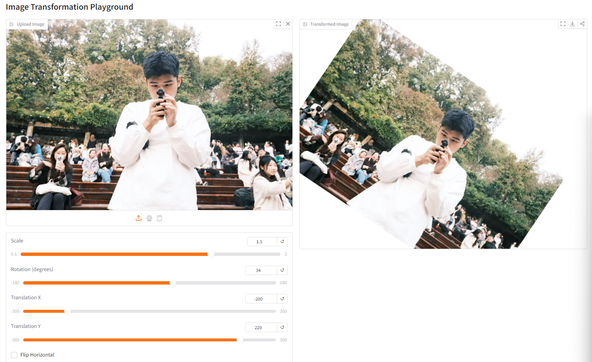
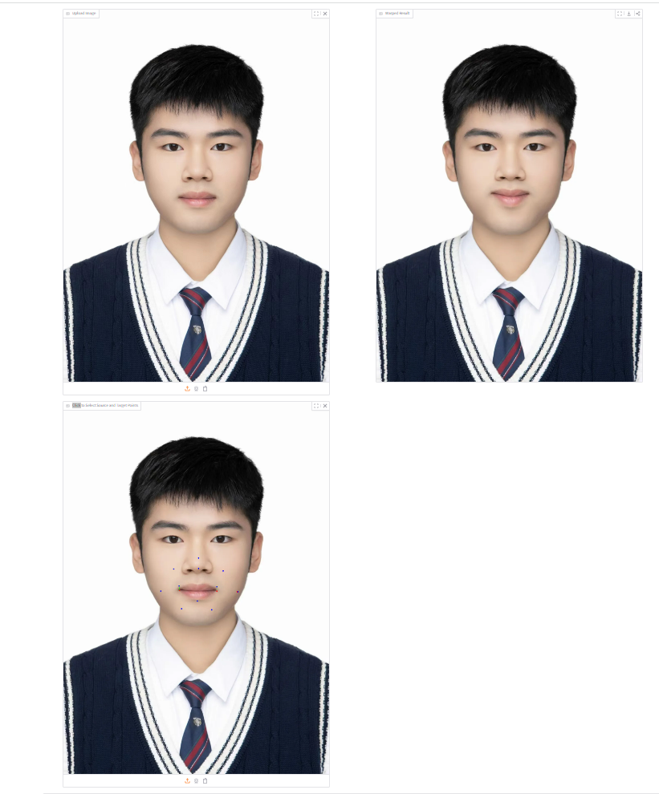
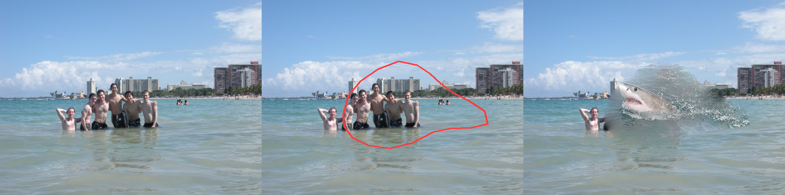
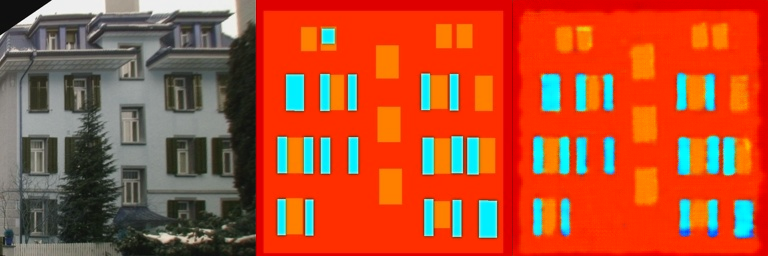
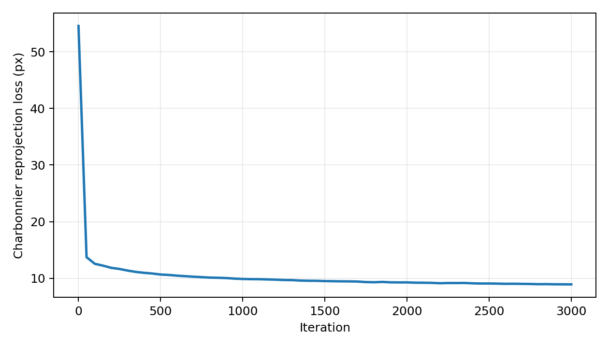
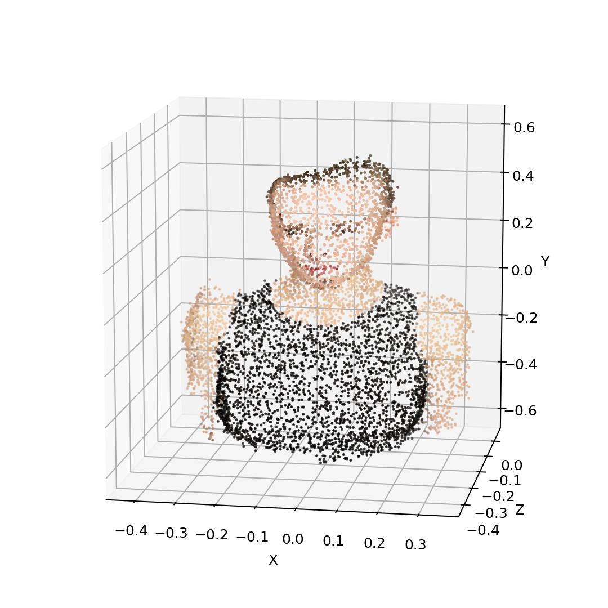
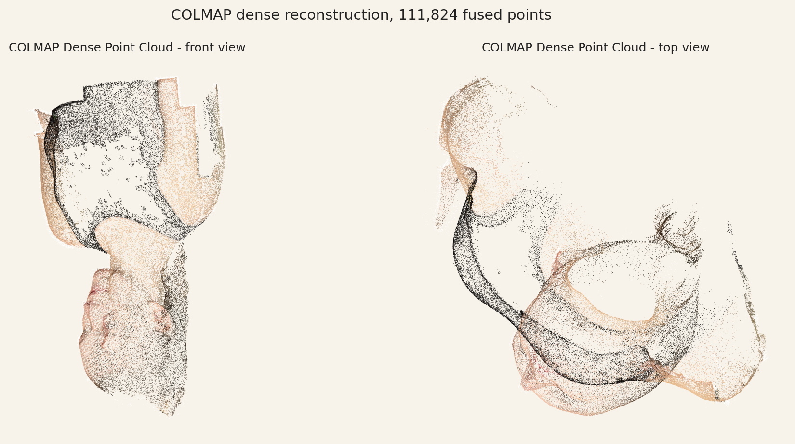
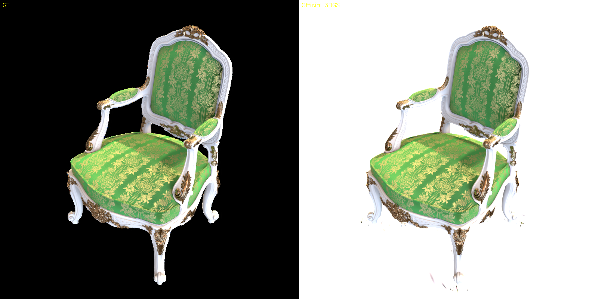

# DIP-Learning

数字图像处理课程作业仓库，当前按作业编号进行整理，便于查看与提交。

## 作业导航

- [第一次作业：Image Warping](./Assignment01/README.md)
- [第二次作业：Poisson Image Editing 与 Pix2Pix](./Assignment02/README.md)
- [第三次作业：Bundle Adjustment 与 COLMAP 三维重建](./Assignment03/README.md)
- [第四次作业：3D Gaussian Splatting](./Assignment04/DIP_HW4_3DGS_submission/README.md)

## 目录结构

```text
DIP-Learning/
├─ Assignment01/
│  ├─ README.md
│  ├─ requirements.txt
│  ├─ run_global_transform.py
│  ├─ run_point_transform.py
│  └─ test_pics/
├─ Assignment02/
│  ├─ README.md
│  ├─ Poisson/
│  └─ Pix2Pix/
├─ Assignment03/
│  ├─ README.md
│  ├─ bundle_adjustment.py
│  ├─ data/
│  └─ results/
└─ Assignment04/
   └─ DIP_HW4_3DGS_submission/
      ├─ README.md
      ├─ REPORT.md
      ├─ data/
      └─ results/
```

## 说明

- `Assignment01` 对应第一次作业，内容为图像几何变换与基于控制点的图像形变。
- `Assignment02` 对应第二次作业，内容为 Poisson 图像融合与 Pix2Pix 图像到图像翻译。
- `Assignment03` 对应第三次作业，内容为 PyTorch Bundle Adjustment 与 COLMAP 稀疏/稠密三维重建。
- `Assignment04` 对应第四次作业，内容为 3D Gaussian Splatting 重建、渲染与定量评估。
- 第二次作业中仅保留了与提交直接相关的代码、结果图和中文说明文档，效果较差的 Pix2Pix 结果图未放入提交目录。
- 第三次作业中保留了 BA 代码、输入数据、关键结果文件和结果图；COLMAP 的大体积中间缓存未提交。
- 第四次作业中保留了训练/评估代码、输入数据、COLMAP 文本结果、渲染示例、指标文件和实验报告。

## 作业预览

### 第一次作业：Image Warping

全局几何变换示例：



控制点形变示例：



### 第二次作业：Poisson Image Editing 与 Pix2Pix

Poisson 融合效果：



Pix2Pix 结果示例：



### 第三次作业：Bundle Adjustment 与 COLMAP 三维重建

Bundle Adjustment 损失曲线：



PyTorch BA 彩色点云预览：



COLMAP 稠密点云预览：



### 第四次作业：3D Gaussian Splatting

官方管线渲染示例：


